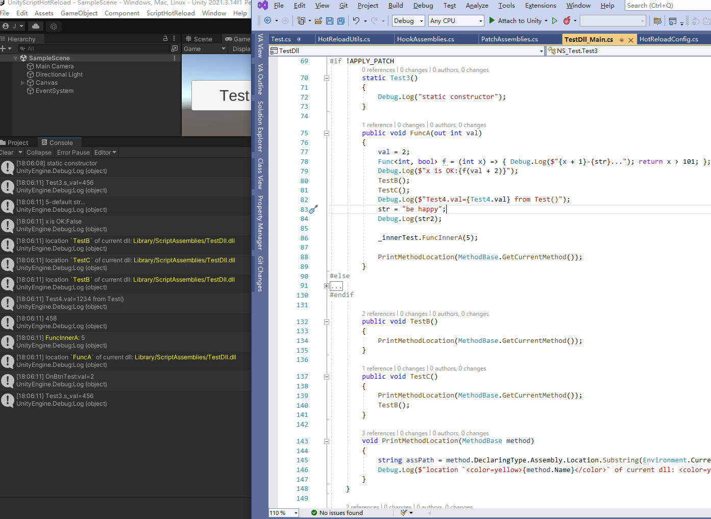
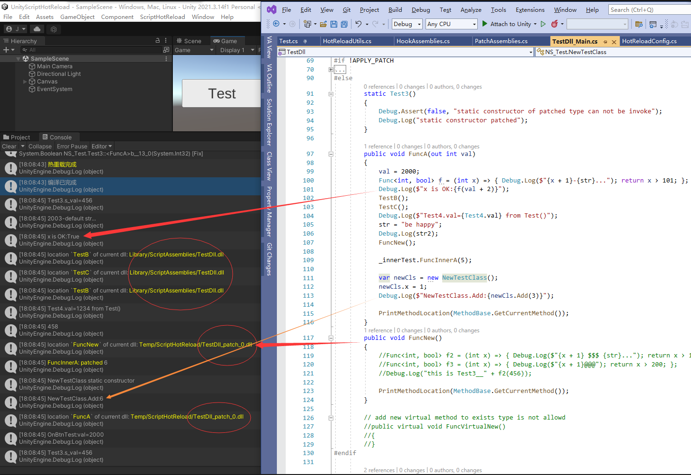
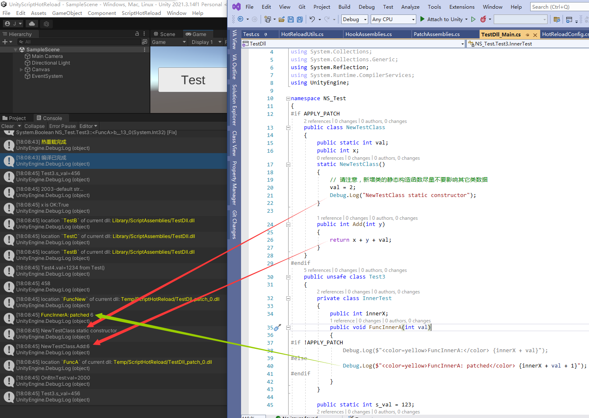
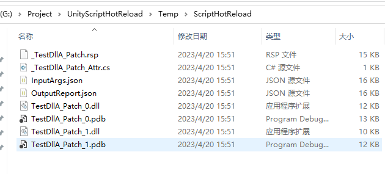
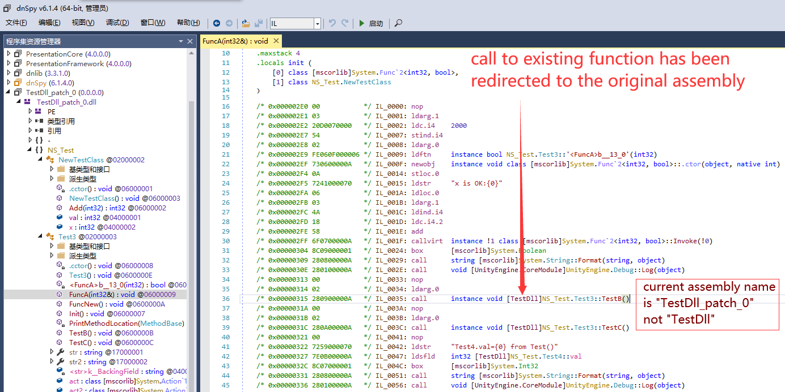
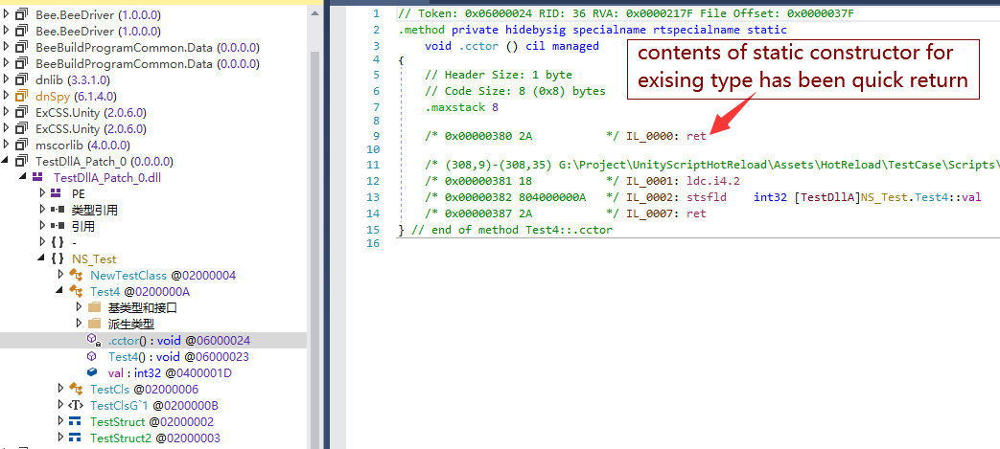
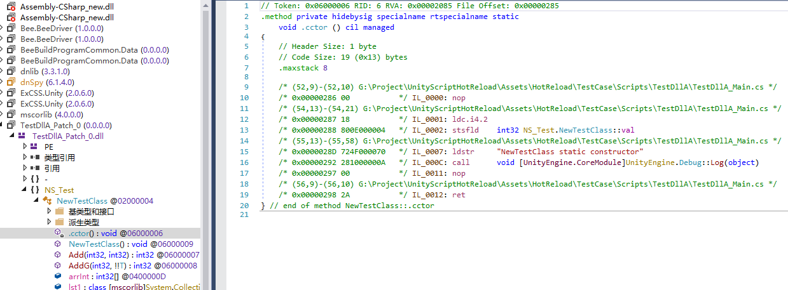

# UnityScriptHotReload
本仓库可以实现运行中无感重载C#代码

### 主要功能
Unity开发者经常需要在Editor运行起游戏后调试代码，并临时修改代码测试效果，但Unity自身的运行时重新编译C#代码并重载脚本会造成逻辑中断，因此并不可用。  
本仓库解决了这个问题，可以实时修改代码并无缝使用新代码的逻辑继续运行，并保持内存中的数据和线程上下文均不改变。

### 安装步骤
* 复制 `Assets/HotReload` 目录到您的工程
* 如果提示 `Mono.Cecil.dll` 文件有多份，删除 `HotReload/Editor/Plugins/Mono.Cecil.dll` 文件
* 如果提示 `MethodHook` 有冲突，删除 `Assets/HotReload/UnityHook` 目录, 并确保您的本地版本更新到最新
* 打开文件 `HotReload/Editor/HotReloadConfig.cs`, 通过修改`HotReloadConfig.hotReloadAssemblies` 字段预先配置您需要热重载的程序集名称列表

### 使用步骤
1. 点击`Play`按钮启动游戏，测试中发现逻辑错误，假设此场景不容易重现，您并不想停止play修改代码后再重新运行
2. 直接修改C#代码
3. 点击菜单 `【ScriptHotReload/PatchAssemblies】`, 片刻后若控制台出现 **热重载完成** 提示则表示已成功重载
4. 继续测试，逻辑已被修改
5. 发现逻辑依旧有错误，重复步骤 2~4

### 功能及限制
* 可以修改原有函数的内容
* 可以新增普通函数
* 可以新增类型
* **不可以修改已存在类型的成员变量**
* **不可以新增虚函数**
* **对新增类型或者函数的访问只能通过已存在函数的代码调用，一般情况下无法通过反射调用(patch编号是自增的)**

### 测试用例使用步骤
> 测试用例文件为 `Assets/Scripts/TestDll/TestDll_Main.cs`
* 打开场景 `Scenes/SampleScene` 并点击`Play`运行游戏
* 点击场景中的 `Test` 按钮，查看控制台输出
* 启用文件 `TestDll_Main.cs` 顶部的宏定义 `#define APPLY_PATCH`
* 点击菜单 `【ScriptHotReload/PatchAssemblies】`
* 再次点击 `Test` 按钮，对比控制台的输出差异

▶ 执行效果  

* BeforePatch

* AfterPatch0

* AfterPatch1

### 最佳实践
#### 不需要调试被修改代码时: 
> 直接原地修改C#代码即可
#### 需要调试代码时：
> 由于调试器要求pdb中的行号与文件中的定义完全一致断点才会生效，因此原有代码行号不能改变，此时可以将需要修改的函数整体注释，然后复制到文件末尾，再修改其内容。

### 实现原理
本仓库会在运行状态下使用与UnityEditor编译Editor下的程序集时完全一致的参数生成一份新的dll到临时目录, 然后对比新的dll与原始dll的差异，将差异函数使用 inline hook 跳转到新的dll实现。  
由于新的dll内的类型和函数与原始dll虽然名称相同，但实际是不同的类型，为了避免正在运行的代码出现类型校验异常，本方案在新的dll在被载入内存前会使用Mono.Cecil对其函数体进行修正，将其对字段和函数的访问全部替换为对同名的原始dll内对应类型的访问，同时清除新dll的相关类型的静态构造函数以避免其逻辑被执行两次（新增类型不清除而是Fix，因其静态构造函数未执行过）。最后将新dll载入内存后执行hook实现patch。

* 临时文件路径  

* 函数重定向

* 已存在类型的静态构造函数

* 新类型的静态构造函数

### 第三方库
* https://github.com/Misaka-Mikoto-Tech/MonoHook